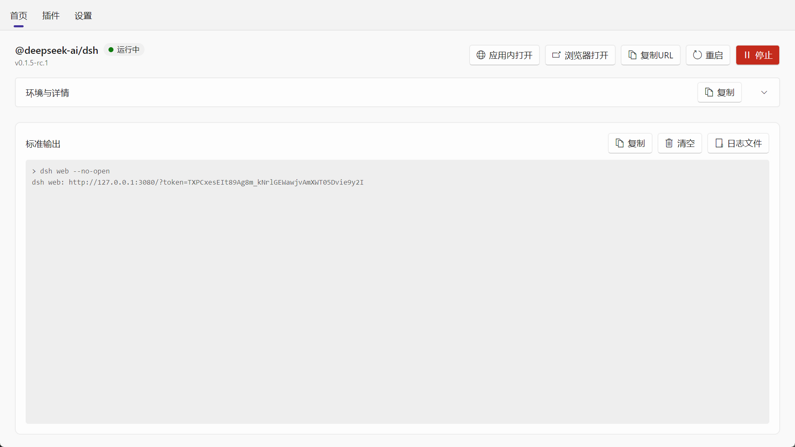
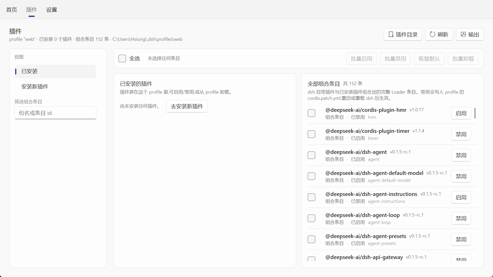
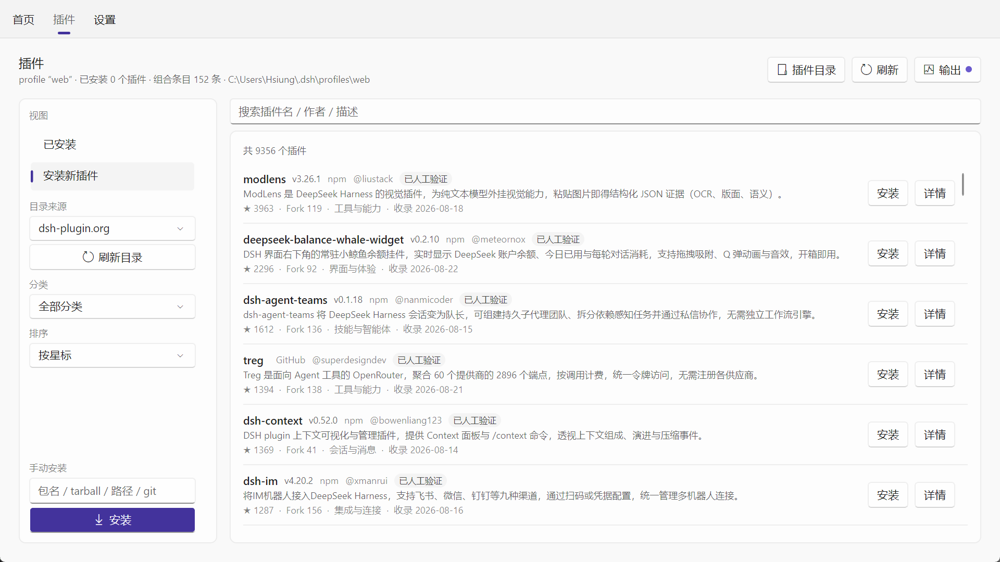
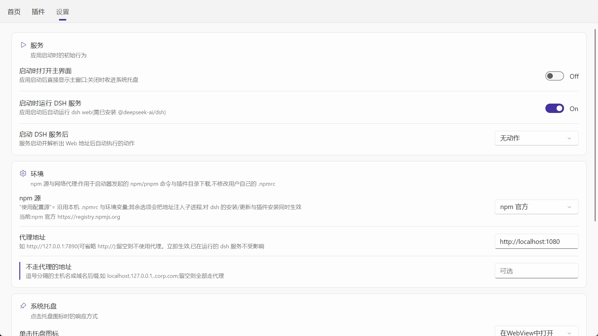
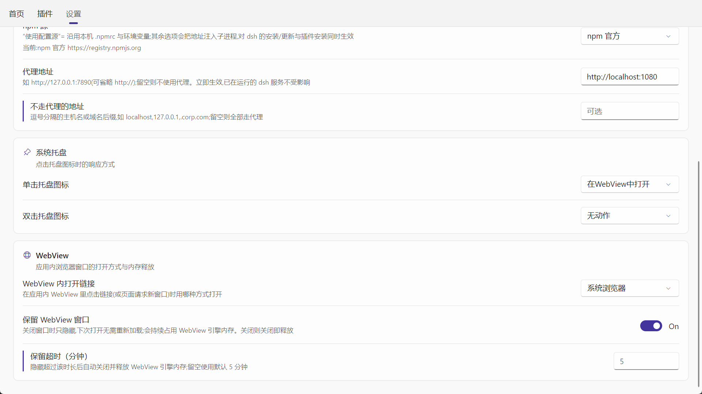

# DSH Launcher

[DeepSeek Shell (dsh)](https://www.npmjs.com/package/@deepseek-ai/dsh) 的桌面启动器 —— 用 Avalonia 打造的 Windows 图形化外壳。

它把 `dsh` 的安装、启停、Web 界面访问、插件管理这些命令行操作，收进一个常驻系统托盘的 WinUI 风格窗口里。



---

## 功能特性

### 服务管理
- **一键安装 / 更新**：探测 `dsh` 是否安装，显示已安装版本与 npm 上的最新版本，有更新时给出「更新」按钮。
- **启动 / 停止 / 重启**：通过 `dsh web` 启动服务，自动从输出中解析 Web 地址（形如 `http://127.0.0.1:3080/?token=...`）。
- **端口配置**：可自定义监听端口（1–65535），留空使用 dsh 默认的 `3080`。
- **进程树清理**：停止时连同子进程一起终止（Windows 用 Job Object，其他平台用 `Kill(entireProcessTree)`），应用退出/系统关机时也会兜底停止服务。
- **实时日志**：`dsh web` 的标准输出实时显示在首页日志卡片中，支持复制、清空、在文件管理器中定位日志文件。

### 开机自启动
默认**关闭**，在设置页「服务」卡片里开启：开启后把启动器写进系统自启动项（**当前用户**级，不需要管理员权限），
下次登录系统时自动拉起，并**直接收进系统托盘**（不弹主界面 —— 登录就弹窗是自启动最容易被关掉的原因），
服务再按「启动时运行 DSH 服务」照常启动。由系统拉起的这次启动会带 `--autostart` 标记，app.log 里据此可分辨。

- **落点**：Windows 是注册表 `HKCU\Software\Microsoft\Windows\CurrentVersion\Run` 下名为 `DSH Launcher` 的字符串值；
  macOS 是 `~/Library/LaunchAgents/com.dsh-launcher.autostart.plist`；Linux 是 `~/.config/autostart/dsh-launcher.desktop`。
  写进去的是**带引号的当前程序路径** + `--autostart`，所以安装路径含空格也没问题。
- **自愈**：每次启动都会把系统侧与设置对齐 —— 程序换了安装目录（注册项指向旧路径）会更新、注册项被手工删掉会补写、
  设置关着却还残留着旧注册项会清除（`AutoStartService.Reconcile`）。只在**确有差异**时才写系统，
  不会每次启动都重写注册表。
- 设置页那一行下方显示的是**系统侧的真实状态**（已注册 / 未注册 / 指向其它路径），鼠标悬停可看到自启动项的完整位置与内容。
- 写入失败（组策略、安全软件拦截）时开关会退回原状，并把原因写在状态行里，不会出现「设置开着而系统里其实没有」。

### 环境信息
首页可展开的面板，展示运行状态（PID / 启动时刻）、应用版本、已安装版本、Node.js 与 npm 版本、`dsh` 可执行文件路径、WebView 引擎版本。

### Web 界面访问
- **应用内打开**：内置 WebView 窗口（Windows 走 WebView2，macOS 走 WKWebView）。
- **浏览器打开**：调用系统默认浏览器。
- **复制 URL**：把带 token 的完整地址复制到剪贴板。

WebView 做了两项体验优化：
- **窗口复用**：关闭时默认只隐藏而非销毁，再次打开是毫秒级复用（冷启动约 940ms，复用约 200ms）。
- **空闲释放**：隐藏超过设定时长（默认 5 分钟，可关闭该行为）后自动关闭并释放 WebView 进程内存。

### 插件管理
内置插件页，直接读写 dsh 的 profile（默认 `~/.dsh/profiles/web`）：

- **已安装的插件**：列出当前 profile 的 `dependencies`，支持**启用 / 禁用**（通过往 `cordis.patch.yml` 写定向覆盖实现）、**卸载**、**恢复默认**。
- **全部组合条目**：展示 `dsh --profile web --dump-config` 输出的完整组合清单（含自带 bundle），可搜索筛选。
- **批量操作**：每行勾选框 + 批量栏，支持全选（作用于当前筛选结果）、批量启用/禁用/卸载/恢复。
- **安装新插件**：从社区策展目录搜索并一键安装（转发给 `dsh plugin --profile web add ...`）。
  - 支持两份目录：默认 `awesome-dsh-plugin.com`（约 3700 条），或 `dsh-plugin.org`（约 9300 条，带人工验证标记）。目录结构自动识别，按地址缓存，可手动刷新。
  - 也支持手动输入包名/`github:owner/repo` 规格安装。
- **安装输出**：浮动日志窗实时显示安装/卸载输出；安装开始时自动弹出，关闭后有新日志会显示未读小圆点。





### 系统托盘
- 单击 / 双击托盘图标可分别配置为：在 WebView 中打开、在浏览器中打开、显示主界面、无动作。
- 关闭主窗口默认最小化到托盘（可配置为直接退出）。
- 托盘右键菜单可控制服务启停与退出程序。

### 重复启动
启动器是单实例常驻程序：再次启动（例如又点了一次桌面快捷方式）不会开出第二个实例，
而是通知已在运行的实例按设置页的「重复启动应用时」响应 —— 无动作 / 打开主界面 / 打开 WebView / 打开浏览器。
选后两项但 dsh 服务未运行（拿不到 Web 地址）时，改为打开主界面；默认打开主界面。

### 设置
WinUI 卡片式设置页，分四组：

| 卡片 | 设置项 |
|---|---|
| **服务** | 开机自启动、启动时打开主界面、启动时自动运行服务、服务就绪后的动作、重复启动时的动作 |
| **系统托盘** | 单击动作、双击动作 |
| **WebView** | 应用内链接打开方式（系统浏览器 / 应用内）、关闭时保留窗口、保留超时（分钟） |
| **环境** | npm 源（使用配置源 / 官方 / npmmirror / 腾讯云 / 华为云）、HTTP 代理、不走代理的地址 |

环境设置会注入到 `npm` / `pnpm` / `dsh plugin` 等子进程，以及插件目录下载所用的 HTTP 客户端；**不影响已在运行的服务**。





### 窗口状态记忆
自动记住主窗口与 WebView 窗口的位置、尺寸、最大化状态，下次启动还原。

---

## 技术栈

| 项 | 版本 |
|---|---|
| .NET | `net10.0`（SDK 10.0.401） |
| Avalonia | 12.1.1 |
| Avalonia.Controls.WebView | 12.1.0 |
| FluentAvaloniaUI | 3.1.0（WinUI 风格控件与主题） |
| CommunityToolkit.Mvvm | 8.4.2 |

架构上刻意保持简单：**无 DI 容器、无 MVVM 框架**，UI 采用 code-behind + `x:Name`，业务逻辑集中在 `Services/` 下的单例服务中。服务事件在后台线程触发，UI 侧统一通过 `Dispatcher.UIThread.Post` 回到 UI 线程。

几处刻意划出的边界：

- **子进程只有一个出口**（`ChildProcessRunner`）：定位命令、注入 npm 源/代理、按行判定编码（Node 写 UTF-8、`cmd.exe` 自身消息是 OEM 代码页）、等待输出读完，全部收在这里；dsh 命令的定位与执行单独放在 `DshCli`，插件页因此不必依赖整个 `DshService`。
- **跨页面的 UI 状态没有重复实现**：日志限长（`LogBuffer`）、刷新节流（`LogAppendThrottle`）、复制反馈（`CopyFeedback`）、卡片外观与代码区底色（`App.axaml`）都是单一定义。
- **最微妙的两块各自独立成文件**：`SingleInstanceGuard`（互斥体 + 命名管道）与 `CompatChainEscape`（上游进程链逃逸，附完整成因说明）——它们都是"改错了很难查"的逻辑，不该混在窗口/托盘代码里。
- **纯逻辑与界面分离到可测**：插件目录的加载状态机（缓存命中/同地址去重/世代号防"慢的旧来源覆盖新来源"）是 `CatalogLoadController`，启动失败诊断是 `StartFailureDiagnostics`，两者都不依赖界面。
- **状态挂数据对象、不挂控件**：列表是虚拟化的（容器会回收复用），所以"勾选""待确认卸载"这类状态存在 `PluginEntry` 上，而不是写在 `Button.Content` 里。
- **命名空间与文件夹一致**：`Services/Plugins/*` → `DSH_Launcher.Services.Plugins`，`Views/Shared/*` → `DSH_Launcher.Views.Shared`。
- **纯逻辑有单元测试兜底**（`DSH Launcher.Tests`，见下文）：版本比较、日志裁剪、`cordis.patch.yml` 读写、两份插件目录的解析、`--dump-config` 解析、目录加载时序、编码判定、设置 JSON 的宽容枚举解析、自启动项的格式与对齐决策表等。

---

## 构建与运行

```powershell
# 构建
dotnet build "DSH Launcher.slnx"

# 运行（开发调试）
dotnet run --project "DSH Launcher/DSH Launcher.csproj"
```

> 构建前建议先结束正在运行的实例（`Stop-Process -Name "DSH Launcher"`），否则输出程序集可能被占用。
> ⚠ 但如果你的**当前工作会话**（例如 `dsh web` + 浏览器/WebView）正是这个启动器拉起来的，结束它会连带结束那个会话 ——
> 这种情况请先确认会话可以从别处恢复，或改用另一个构建输出目录。

发行版另附 `Properties/PublishProfiles/DSH Launcher_Windows_x64.pubxml` 发布配置。

### 运行测试

```powershell
dotnet test "DSH Launcher.Tests/DSH Launcher.Tests.csproj"
```

测试项目覆盖的是**不依赖界面的纯逻辑**：版本比较、日志限长与裁剪、`cordis.patch.yml` 托管区块读写、两份社区目录的解析与筛选排序、**目录加载的并发时序**（慢的旧来源不得覆盖新来源、缓存命中要顶掉在飞请求）、`dsh --dump-config` 输出解析、子进程输出编码判定、设置 JSON 与宽容枚举解析、插件条目的界面状态、启动失败提示、开机自启动项的格式（Windows Run 命令行的引号与反解析、plist / .desktop 正文、XML 转义）、`--autostart` 标记识别、自启动对齐决策表与状态提示文案。这些都是注释里写满"实测踩过的坑"的地方，也正是重构中最容易被静默改坏的地方。

> 若本机访问不到 nuget.org，测试包（MSTest）可从 Visual Studio 自带的离线包源还原：
> ```powershell
> dotnet restore "DSH Launcher.Tests/DSH Launcher.Tests.csproj" --source "C:\Program Files (x86)\Microsoft SDKs\NuGetPackages"
> ```

> **构建排错**：Avalonia 的构建期遥测任务会往 `%LOCALAPPDATA%\AvaloniaUI` 写日志，写不进去会让构建以 `MSB4018` 直接失败。
> 用 `-p:UsedAvaloniaProducts=` 可跳过该任务（CI 上也这么用）。
> 另外，若 .NET SDK 安装不完整（`sdk\<版本>\Sdks` 下缺 `Microsoft.NET.SDK.WorkloadAutoImportPropsLocator`
> 等 workload 定位 SDK），**任何多项目解决方案**在 solution 级构建/还原时都会以 `MSB4276` 失败（单项目与项目级命令正常）——
> 这是 SDK 安装问题，修复后即可把 `DSH Launcher.Tests` 加回 `DSH Launcher.slnx`（slnx 里有对应说明）。


### 打包安装包（Inno Setup）

需要 PowerShell 7+，以及 [Inno Setup 6](https://jrsoftware.org/isdl.php) 或更高版本。

```powershell
# 发布 + 编译安装包，一步到位
.\Build-Installer.ps1

# 只发布（输出到 DSH Launcher\bin\Publish\DSH Launcher_Windows_x64）
.\Publish-App.ps1
```

`Publish-App.ps1` 默认会**结束正在运行的 DSH Launcher**（常驻托盘的单实例程序，占用文件会让发布失败）
并**清空发布目录**（`dotnet publish` 不会删除旧产物，残留的 `.pdb`、`Assets\logo.ico` 会被打进安装包），
分别用 `-KeepRunning`、`-NoClean` 关掉。

`Build-Installer.ps1` 默认先调用 `Publish-App.ps1`（`-NoPublish` 可跳过），自动查找 `ISCC.exe`
（`-ISCC` → PATH → 注册表 → 常见安装位置），并在编译前校验 `installer.iss` 的 `MyPublishDir` 里
确实有程序文件，最后产出 `Setup\DSHLauncher-Setup-x64.exe`（同时打印文件大小与 SHA256）。

不用脚本的等价手工步骤：

```powershell
dotnet publish "DSH Launcher/DSH Launcher.csproj" -p:PublishProfile="DSH Launcher_Windows_x64" -c Release
```

再用 Inno Setup 的 IDE 打开 `Setup/installer.iss` 编译（或 `ISCC.exe Setup\installer.iss`）。
发布为框架依赖版，要求用户机器已装 [.NET 10 Desktop Runtime](https://dotnet.microsoft.com/download/dotnet/10.0)。

安装程序内置 .NET 10 Desktop Runtime 检测：缺失时引导用户到官网下载后再装；支持中文向导、
开始菜单/桌面快捷方式与卸载。

安装/卸载时会检测应用的单实例 Mutex，若应用正在运行（常驻托盘）会提示先关闭，避免文件被占用。
**卸载时会询问是否清理用户数据**：选「是」删除 `%APPDATA%\DSH Launcher` 与 `%LOCALAPPDATA%\DSH Launcher`
（设置、日志、窗口状态记忆、WebView2 缓存），选「否」（默认按钮）保留，重新安装后可继续使用原设置。
静默卸载（`/SILENT`、`/VERYSILENT`）不弹框、默认保留；要强制清理加 `/CLEANDATA`，强制保留加 `/KEEPDATA`。

开机自启动项**无条件**清理（与「是否清理用户数据」无关）：程序文件都删了，注册项还留着的话，
每次登录 Windows 都会尝试启动一个不存在的 exe。

---

## 目录结构

```
DSH Launcher.slnx                 解决方案（.slnx 格式；测试项目暂未列入，原因见文件内说明）
global.json                       .NET SDK 版本（CI 与本地一致）
Directory.Build.props             全仓库共用的编译设置（语言版本、可空性、分析器、可复现构建）
.editorconfig                     代码风格基线
DSH Launcher/
  App.axaml(.cs)                  应用入口：主题、托盘、单实例、退出清理
  Program.cs                      程序入口
  app.manifest                    Windows 清单（DPI 感知等）
  Assets/                         图标资源（logo.ico / logo-512.png）
  Views/                          界面
    MainWindow.axaml(.cs)         主窗口 + 顶部导航（首页/插件/设置）
    HomePageControl.axaml(.cs)    首页：状态、启停、端口、日志、环境信息
    PluginsPageControl.axaml(.cs) 插件页：已安装 / 安装新插件
    SettingsPageControl.axaml(.cs)设置页：服务 / 托盘 / WebView / 环境
    Shared/                       页面共用的小件
      LogAppendThrottle.cs        日志面板刷新节流（整段重排的代价见文件内说明）
      CopyFeedback.cs             「复制 → 已复制」反馈
      CatalogLoadController.cs    插件目录加载状态机（缓存/去重/世代号，被单元测试覆盖）
  Services/                       业务服务（单例为主）
    DshService.cs                 核心：安装、启停、日志、版本检查、环境探测
    DshService.JobObject.cs       Windows Job Object，保证子进程随主进程退出
    DshService.Diagnostics.cs     启动失败诊断的接线（规则表见 StartFailureDiagnostics）
    StartFailureDiagnostics.cs    失败输出 → 可操作提示 → 依赖层快照留证
    ChildProcessRunner.cs         子进程执行的唯一出口（环境注入 + 逐行编码判定 + 等待输出读完）
    DshCli.cs                     dsh 命令定位与子命令执行（插件页不再依赖整个 DshService）
    SingleInstanceGuard.cs        单实例：互斥体 + 命名管道
    CompatChainEscape.cs          上游进程链逃逸（附完整成因与"不要删"的理由）
    PluginService.cs              插件清单读写、启停覆盖、目录拉取、安装卸载
    Plugins/
      PluginPatchFile.cs          cordis.patch.yml 托管区块的读写（格式知识集中在此）
      PluginCatalogReader.cs      两份社区目录 JSON 的解析归一
    SettingsService.cs            设置模型与 JSON 持久化（含宽容枚举解析）
    AutoStartService.cs           开机自启动：读写系统自启动项 + 启动时与设置对齐（Windows Run / LaunchAgent / XDG）
    AutoStartEntry.cs             自启动项的落点与格式（纯字符串拼装，被单元测试覆盖）
    StartupArguments.cs           `--autostart` 标记：系统拉起的这一次不再弹主界面
    ChildEnvironment.cs           npm 源 / 代理注入子进程与 HttpClient
    PlatformProcess.cs            跨平台进程启动、命令定位、路径与输出解码
    WebOpener.cs                  WebView 窗口管理、引擎探测（窗口复用/空闲释放）
    BrowserLauncher.cs            用系统默认浏览器打开地址（与 WebView 无关，故独立）
    WindowStateService.cs         窗口位置/尺寸/最大化状态记忆
    TrayService.cs                系统托盘图标与交互
    LogBuffer.cs                  有上限的日志缓冲区（防面板假死）
    AppLogService.cs              应用日志文件
    AppIcon.cs                    嵌入图标资源的加载
  Properties/PublishProfiles/     dotnet publish 发布配置（DSH Launcher_Windows_x64）
DSH Launcher.Tests/               单元测试（MSTest，覆盖上表中的纯逻辑）
  LogBufferTests.cs               日志限长与裁剪
  VersionComparisonTests.cs       版本比较
  PluginPatchFileTests.cs         cordis.patch.yml 托管区块读写
  PluginCatalogReaderTests.cs     两份社区目录解析
  PluginCatalogFilterTests.cs     目录筛选与排序
  CompositionDumpTests.cs         --dump-config 解析 + 规格归一化
  EnvironmentAndEncodingTests.cs  代理/不走代理归一化 + 输出编码判定
  SettingsJsonTests.cs            设置 JSON 与宽容枚举解析
  RepeatLaunchOptionsTests.cs     “重复启动应用时”的选项顺序与枚举值互转
  FailureAnalysisTests.cs         启动失败提示
  CatalogLoadControllerTests.cs   目录加载时序（慢的旧来源/缓存命中顶掉在飞请求）
  PluginEntryTests.cs             插件条目的界面状态（勾选、待确认卸载）
  AutoStartTests.cs               自启动项格式、`--autostart` 标记、对齐决策表与状态提示文案

Publish-App.ps1                   发布到 bin/Publish 的脚本（清空旧产物、结束运行中的实例）
Build-Installer.ps1               先调 Publish-App.ps1 发布，再用 Inno Setup 编译安装包
Setup/
  installer.iss                   Inno Setup 安装包脚本
docs/screenshots/                 README 中使用的界面截图
.github/workflows/build.yml       CI：Release 构建 + 跑测试
.github/skills/                   仓库自带的界面验证 skill（UI Automation，见 SKILL.md）
```

---

## 数据与配置位置

| 内容 | Windows | macOS |
|---|---|---|
| 设置 | `%APPDATA%\DSH Launcher\Settings\settings.json` | `~/Library/Application Support/DSH Launcher/Settings/settings.json` |
| 应用日志 | `%LOCALAPPDATA%\DSH Launcher\Settings\app.log` | 同上目录下 `app.log` |
| 窗口状态 | 同上目录下 `window-state.json` | 同上 |

设置文件只在有改动时写回；新增字段在用户首次修改前不会出现在文件里。枚举值按名称解析，删除枚举成员不会导致已有设置被重置。

被管理的 dsh profile 位于 `~/.dsh/profiles/web`，插件启停通过改写该目录下的 `cordis.patch.yml` 实现。

系统自启动项（**开启「开机自启动」后才会存在**，关闭即删除）：

| 平台 | 位置 |
|---|---|
| Windows | 注册表 `HKCU\Software\Microsoft\Windows\CurrentVersion\Run` 下名为 `DSH Launcher` 的字符串值 |
| macOS | `~/Library/LaunchAgents/com.dsh-launcher.autostart.plist`（Label `com.dsh-launcher.autostart`，RunAtLoad） |
| Linux | `~/.config/autostart/dsh-launcher.desktop`（XDG autostart） |

---

## 已知限制

- **平台**：主要在 Windows 上开发与验证。代码已做了大量跨平台抽象（进程启动、路径、输出编码、WebView 引擎探测、数据目录、系统浏览器打开），但 macOS 侧仍缺：应用打包（`.app` bundle + `Info.plist` + ATS 例外 + 签名公证）、更惯用的单实例机制、以及窗口状态中若干 Win32 坐标假设的实测校正。
- **监听地址固定为 `127.0.0.1`**：`dsh web` 的 `--host` 实际被上游硬拦截（仅接受 `127.0.0.1` / `0.0.0.0`，且 `0.0.0.0` 被启动脚本以安全理由拒绝），因此启动器不提供监听地址配置。
- **插件启停非官方 API**：`dsh` 目前没有插件启停的官方接口，启动器是通过写 `cordis.patch.yml` 实现的，属自行实现（写入区域有注释标记包裹）。
- **pnpm 依赖**：安装/卸载插件需要可用的 `pnpm`。界面会探测并在未就绪时给出提示（启用/禁用不依赖 pnpm）。
- **开机自启动的落点只在 Windows 上实测过**（注册表写入/删除、旧路径自愈、残留清理都由真实注册表验证）；
  macOS 的 LaunchAgent 与 Linux 的 XDG `.desktop` 是照各自规范实现的，尚未在真机验证。
  另外，以 `dotnet run`（`dotnet` 主机）启动时拿不到程序本体路径，此时这一项会直接禁用并说明原因 ——
  注册一个指向 `dotnet.exe` 的自启动项毫无意义。

---

## 相关链接

- 被管理的服务：[`@deepseek-ai/dsh`](https://www.npmjs.com/package/@deepseek-ai/dsh)
- 界面框架：[Avalonia](https://avaloniaui.net/)
- WinUI 风格控件：[FluentAvaloniaUI](https://github.com/amwx/FluentAvalonia)
- 插件目录：[awesome-dsh-plugin](https://awesome-dsh-plugin.com/) · [dsh-plugin.org](https://dsh-plugin.org/)

---

## 许可证

本项目采用 [MIT 许可证](LICENSE)。
